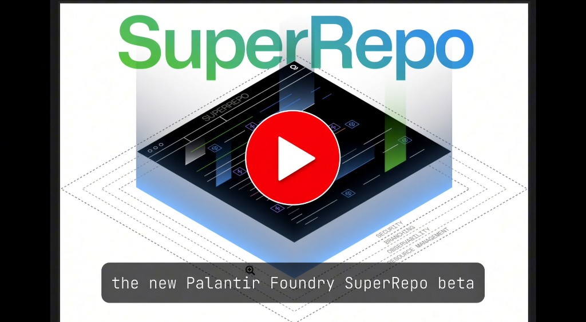
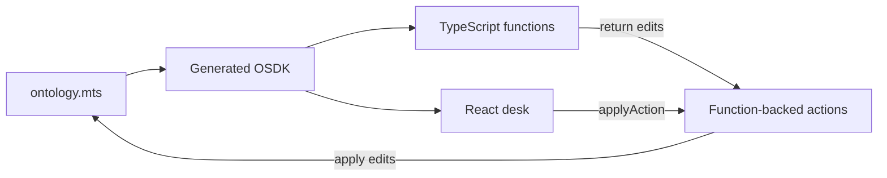

# Harbor Desk

Built by George Gorzhiyev as a Palantir Foundry **SuperRepo** case study: ontology-as-code, TypeScript policy functions, and a React investigation desk in one repo.

Harbor Desk is a financial-crime casework desk. Analysts open a case on a person or an organization, attach findings, and close the file only when every open finding is resolved and a **second analyst** approves.

The demo story is **CASE-2041 — Northwind Holdings**, a newly formed Delaware LLC whose treasury wallet was funded within 48 hours of incorporation.

<a href="https://youtu.be/BD0BlafZ7qE">
  
</a>

*YouTube walkthrough — [watch here](https://youtu.be/BD0BlafZ7qE).*

## What this demonstrates

- **Ontology-as-code** — people, organizations, wallets, cases, and findings are typed in [`ontology/src/ontology.mts`](ontology/src/ontology.mts), not drawn only in a UI.
- **Policy in functions, not in React** — close lives in [`requestClose.ts`](functions/typescript-functions/src/functions/requestClose.ts) and [`policy.ts`](functions/typescript-functions/src/lib/policy.ts). The desk is a client.
- **One SuperRepo product** — ontology, functions, and the React app version and deploy together as a Marketplace product.

Instances exist because actions (or local seed) created them. SuperRepo cannot yet own pipelines or chain ingest; those stay on classic Foundry. This repo can import those types later with `foundry import ontology`.



## If you cannot run Foundry

There is no public live site. SuperRepo deploys onto a Foundry enrollment, not a public URL. The walkthrough is above.

Skim [`requestClose.ts`](functions/typescript-functions/src/functions/requestClose.ts), [`policy.ts`](functions/typescript-functions/src/lib/policy.ts), and [`ontology.mts`](ontology/src/ontology.mts) for the model and the close rules.

Teaching depth (not the entry point): [study guide](./docs/study-guide.md) (how SuperRepo pieces connect) and [ontology guide](./docs/ontology-guide.md) (Palantir ontology design, Harbor Desk as the example).

## Run locally

```bash
foundry login
foundry install pnpm
pnpm run dev
```

App: http://localhost:8080 (or the port the CLI prints). Seed loads Northwind on every ontology start.

`foundry.yml` `signingKeys` points at the local Foundry CLI key from `foundry login` (`~/Library/Application Support/foundry-cli/keys/default.pem` on macOS). That path is not a secret. Do not commit the `.pem`. On another machine, point it at your own key after login.

[SuperRepo](https://www.palantir.com/docs/foundry/superrepo/overview/) is Palantir beta (week of 3 August 2026). It may not be on every enrollment, and it may change.

## Deploy

```bash
pnpm run configure
FOUNDRY_PRODUCT_VERSION=1.0.0 pnpm run build
foundry deploy
```

Then Developer Console: approve the website domain and deploy the latest asset. After install the ontology is empty — click **Load demo**.

`env.yml` is enrollment-specific. Palantir’s private-team workflow commits it for Foundry CI; this repo gitignores it. Copy `env.yml.example`. Details in the study guide.

## Layout

- `ontology/src/ontology.mts` — source of truth
- `ontology/seed/001-harbor.mts` — local only
- `functions/typescript-functions/src/functions/` — policy
- `app/src/desk/` — Blueprint ops console
- `foundry.yml` — SuperRepo manifest

Generated: `ontology/osdk-output/`, `ontology/src/generated-imports/`. Do not edit.

Tags that deploy must be exact `MAJOR.MINOR.PATCH` (no `v`).

MIT license. Palantir names, documentation, and SDKs remain theirs.
