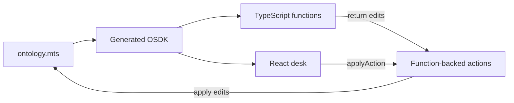

# Harbor Desk

A writeback financial-crime **casework desk** on Palantir Foundry. Analysts open a case on a person or an organization, attach findings (including wallets), and close the file only when every open finding is resolved and a **second analyst** approves.

The demo story is **Case 2041 — Northwind Holdings**, a newly formed Delaware LLC whose treasury wallet was funded within 48 hours of incorporation.

## What this demonstrates

- **Ontology-as-code** — people, organizations, wallets, cases, and findings are typed in `ontology/src/ontology.mts`, not drawn only in a UI.
- **Policy in functions, not in React** — close rules and risk live in TypeScript functions. The desk is a client.
- **One SuperRepo product** — ontology, functions, and the React app version and deploy together as a Marketplace product.

Instances exist because actions (or local seed) created them. SuperRepo cannot yet own pipelines or chain ingest; those stay on classic Foundry. This repo can import those types later with `foundry import ontology`.



## Run locally

```bash
foundry login
foundry install pnpm
pnpm run dev
```

App: http://localhost:8080 (or the port the CLI prints). Seed loads Northwind on every ontology start.

Spoken walkthrough (about a minute, for a recruiter or a first look): [docs/demo-script.md](./docs/demo-script.md).

## Learn more

- [docs/study-guide.md](./docs/study-guide.md) — SuperRepo, this repo, local preview, request-close traces, deploy.
- [docs/ontology-guide.md](./docs/ontology-guide.md) — Palantir ontology design, with Harbor Desk as the example.

[SuperRepo](https://www.palantir.com/docs/foundry/superrepo/overview/) is Palantir beta (week of 3 August 2026). It may not be on every enrollment, and it may change.

## Deploy

```bash
pnpm run configure
FOUNDRY_PRODUCT_VERSION=1.0.0 pnpm run build
foundry deploy
```

Then Developer Console: approve the website domain and deploy the latest asset. After install the ontology is empty — click **Load demo**.

`env.yml` is enrollment-specific. Palantir’s private-team workflow commits it for Foundry CI; this public repo gitignores it. Copy `env.yml.example`. Details in the study guide.

## Layout

- `ontology/src/ontology.mts` — source of truth
- `ontology/seed/001-harbor.mts` — local only
- `functions/typescript-functions/src/functions/` — policy
- `app/src/desk/` — Blueprint ops console
- `foundry.yml` — SuperRepo manifest

Generated: `ontology/osdk-output/`, `ontology/src/generated-imports/`. Do not edit.

Tags that deploy must be exact `MAJOR.MINOR.PATCH` (no `v`).
