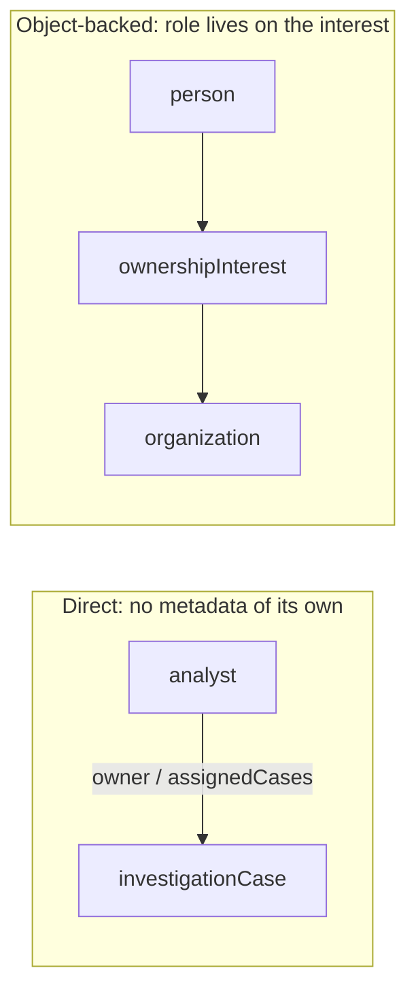
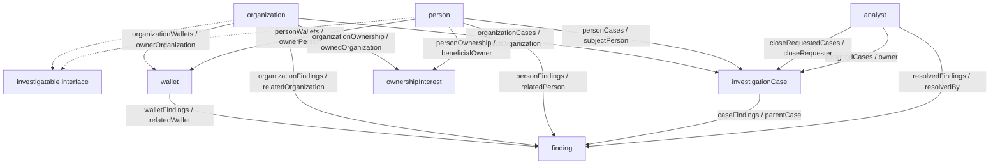

# Ontology design, with Harbor Desk as the example

> This guide was prepared with AI assistance and reviewed against Palantir documentation and the Harbor Desk source. Care was taken to keep it accurate; the platform moves quickly, so small errors may remain. When something matters, prefer the official pages linked at the end.

This guide is about **how Palantir wants you to design an Ontology**: what exists, how it changes, and how to keep the model honest as it grows. Harbor Desk is the worked example. You do not need to run the app to read this.

How SuperRepo packages that Ontology with TypeScript functions and a React desk — local preview, the generated client, deploy — lives in the [study guide](./study-guide.md).

Official Palantir pages this guide is checked against are listed at the end. SuperRepo is in [beta](https://www.palantir.com/docs/foundry/superrepo/overview/) as of the week of 3 August 2026; details can change.

---

## 1. What an Ontology is (in ordinary language)

A database schema answers “what columns do we store?” Palantir’s Ontology answers a different question: **what are the real things in this organization, how do they relate, and how are people allowed to change them?**

Palantir’s [overview](https://www.palantir.com/docs/foundry/ontology/overview/): the Ontology is an **operational layer**. It sits on top of digital assets (datasets, virtual tables, models) and connects them to real-world counterparts — plants, equipment, orders, people. In many settings it is a **digital twin of the organization**.

That is why “ontologize this CSV” is a trap. A spreadsheet row is often several real things glued together. The Ontology is supposed to look like how an investigator (or a doctor, or a warehouse manager) already talks, not like how a source system dumps files.

Harbor Desk started from that talk: a **person**, an **organization**, a **wallet** attributed to one of those, a **case** on a subject, **findings** as evidence on the case, **ownership** as a relationship that has a role, an **analyst** who owns and reviews. There is no chain-ingest table in this repo. Wallets are typed in by hand. That is a SuperRepo limit (no pipelines in this product yet), not a claim that production ingest should work this way.

### Semantic and kinetic

Palantir splits the Ontology into two kinds of element ([overview](https://www.palantir.com/docs/foundry/ontology/overview/)):

| Palantir word | Ordinary meaning | Harbor Desk |
|---|---|---|
| **Semantic** | What exists: object types, properties, links | Person, organization, wallet, case, finding, … in `ontology/src/ontology.mts` |
| **Kinetic** | How it changes under governance: actions, functions, and dynamic security | Function-backed actions such as Open case and Request close. Security is designed, not encoded in this product yet |

**Interfaces** are a third *kind of Ontology type*, not a third official “layer.” An interface “[describes the shape of an object type and its capabilities](https://www.palantir.com/docs/foundry/interfaces/interface-overview/)” and provides polymorphism — one workflow that can talk to several object types that share a shape. Harbor Desk’s `investigatable` is that: person and organization both implement it.

SuperRepo authors the semantic pieces, the interfaces, and the action definitions in `ontology.mts`, and the functions in `functions/`. The generated **OSDK** (Ontology SDK) is the TypeScript client for all of that — not a third layer of the Ontology.

[Object Views](https://www.palantir.com/docs/foundry/object-views/overview), [Object Explorer](https://www.palantir.com/docs/foundry/object-explorer/overview), Quiver, [Workshop](https://www.palantir.com/docs/foundry/workshop/overview), and AIP **consume** the same Ontology. SuperRepo does not author those apps. After Harbor Desk deploys, its types are real types in the Ontology you installed into. Other Foundry tools can use them if they have permission. SuperRepo-installed types are [locked](https://www.palantir.com/docs/foundry/superrepo/faq) by default; you can unlock the project, but edits in [Ontology Manager](https://www.palantir.com/docs/foundry/ontology-manager/overview/) are overwritten on the next SuperRepo deploy. Code is the source of truth.

---

## 2. Four principles (priority order)

Palantir ranks these. When they conflict, the higher one wins. They are guides, not laws — see §6 for the tradeoffs Harbor Desk named on purpose.

Source: [Ontology design: Best practices](https://www.palantir.com/docs/foundry/ontology/ontology-best-practices).

### 2.1 Domain-driven design

**Model the real world, not the source data.**

Object types are things a domain person would recognize (`Patient`, `WorkOrder`, `Wallet`), not tables, API payloads, or spreadsheet tabs. Links are real relationships (“this patient visited this facility”), not leftover join keys.

When someone says “ontologize this dataset,” do not map columns 1:1 and call it done. A CSV with `order_id`, `customer_name`, `customer_email`, `product_sku`, `quantity` is at least three entities (Order, Customer, Product) plus links — not one `OrderData` blob.

Do:

1. Name real-world entities with domain people **before** opening a schema.
2. Split **identity** from **observation**. A measurement or event about an entity is usually a different object type from the entity itself.
3. Name for humans and agents: `person.children`, not `person.linkedChildPersonObjects`. `lastInspectionDate`, not `dtLastInspMod`.
4. Model the domain, then map data into it.
5. Hide types that exist only for technical workflows (`visibility: "HIDDEN"`).

Harbor Desk:

- Northwind Holdings is the **organization**. “Treasury funded within 48 hours of incorporation” is a **finding**, not a column on the organization.
- Elena Varga is a **person**. “Beneficial owner of Northwind” is an **ownershipInterest**, not a note on either party.
- A previous `entity` type was removed. Palantir’s [God Object](https://www.palantir.com/docs/foundry/ontology/ontology-anti-patterns) indicator is asking “What kind of [Object] is this?” Asking that of `entity` failed the test. Person and organization are the split.

### 2.2 Don’t repeat yourself (rule of three)

**One coincidence, two a pattern, three: refactor.**

Goal: one canonical type per concept, one canonical workflow per operation.

Do not fork `SalesCustomer` / `SupportCustomer` / `BillingCustomer`. Prefer one `Customer` with distinguishing properties and department-specific links, or a shared interface if the shapes are genuinely distinct.

Harbor Desk:

- One `person`, one `organization`, one `wallet`, one `investigationCase`, one `finding`. Not `KycPerson` vs `SarPerson`.
- Shared shape across person and organization is the `investigatable` interface plus three **shared property types**: `name`, `jurisdiction`, `notes`. A shared property type is DRY for a single field. An interface is DRY for a capability or a taxonomy.
- Close and risk policy lives in one module (`functions/.../lib/policy.ts`) used by every mutating function.

Still duplicated, on purpose: `personCases` and `organizationCases` (same for wallets and findings). [Structural guidance](https://www.palantir.com/docs/foundry/ontology/ontology-structural-guidance): if the interface is not yet supported in a specific context, **define the interface now and duplicate the workflow per type as a temporary measure**. Harbor Desk did that. When interface-typed links are usable, those pairs collapse.

### 2.3 Open for extension, closed for modification

**Protect field-tested core types. Let others extend them.**

Once `Equipment` is in production, do not bolt `certificationAuthority` / `certificationExpiry` onto it. Add a linked `EquipmentCertification` and optionally a `Certifiable` interface. Core type unchanged. Security boundary unchanged.

Harbor Desk is small, so this is “how the model left room,” not “how three teams survived”:

- A case is a file. Evidence is a linked `finding`, not twenty nullable columns on the case.
- Ownership is a linked type, not `beneficialOwnerRole` on person or organization.
- Wallet is its own type, not `ethAddress` on the organization. When chain ingest exists, it can attach to `wallet` without widening person or organization.
- `investigatable` is the extension point for a future subject (a vessel, a wallet cluster) without rewriting case.

When you add a feature, ask: does this belong on the core type, or on a linked type / new interface implementation? Default to the second.

### 2.4 Composition over deep hierarchies

Foundry interfaces support **multiple inheritance**. Compose capabilities. Do not build `Asset → PhysicalAsset → Building → SchedulableBuilding → Arena`.

Prefer two focused interfaces (`Building`, `SchedulableResource`) and let `Arena` implement both. Adding `SchedulableWarehouse` implements the same two interfaces — no new hierarchy.

Harbor Desk:

- `investigatable` is a **taxonomic** interface (Palantir’s example is `MilitaryAsset` implemented by Aircraft / Vessel / GroundVehicle). Person and organization are the implementing types.
- Harbor Desk did not build `InvestigatableEntity → LegalPerson → Organization`. That would have been the deep-hierarchy anti-pattern.
- Capabilities get their own interfaces when a second use appears (rule of three). There is no `SchedulableInvestigatable`.

Harbor Desk’s duplicated concrete links are that scaffold.

---

## 3. The semantic layer, structurally

This section is [structural guidance](https://www.palantir.com/docs/foundry/ontology/ontology-structural-guidance) applied to Harbor Desk.

### 3.1 Properties: curate, do not vacuum

Every property needs business or technical value. Palantir’s [Kitchen Sink](https://www.palantir.com/docs/foundry/ontology/ontology-anti-patterns) test: “Would someone ever need to see, search, or filter by this?”

Include: business identifiers, human-readable attributes, process dates, statuses used by filters or actions.

Exclude: `_extracted_at`, batch sequence, internal record ids, pipeline debug timestamps. If a join key must exist, hide it.

Harbor Desk properties are short on purpose:

- Person: `id`, `name`, `jurisdiction`, `notes`
- Organization: those plus `legalForm`
- Wallet: `id`, `address`, `chain`, `label`, plus hidden owner foreign keys
- Case: `id`, `title`, `status`, `severity`, `riskScore`, `summary`, plus hidden foreign keys
- Finding: `id`, `title`, `body`, `severity`, `status`, `mitigationNote`, plus hidden foreign keys
- Ownership interest: `id`, `role`, plus hidden foreign keys

The hidden foreign keys (`personId`, `organizationId`, `ownerId`, …) are **not** Kitchen Sink. They are the physical carrier of a link. Palantir naming lives on the **link**, not on the foreign key. Users and agents should see `subjectPerson` / `owner`, never `personId`. That is why `hiddenFk()` sets `visibility: "HIDDEN"` and the description says which link to use.

`notes` / `summary` / `body` / `mitigationNote` are long text. Body is the evidence; mitigationNote is the later decision — do not append one onto the other. The description on `notes` is a design rule: “Relationships belong on links, not only here.” That is how you stop a Kitchen Sink of prose from replacing the graph.

### 3.2 Shared property types

A [shared property type](https://www.palantir.com/docs/foundry/object-link-types/create-shared-property/) is one concept reused across object types. In Maker:

```ts
const nameProperty = defineSharedPropertyType({
    apiName: "name",
    type: "string",
    displayName: "Name",
    description: "Human-readable name of a person or organization.",
});
```

Implementing objects attach it with `sharedPropertyType: nameProperty`. Interfaces can use it directly in their property bag.

This is Palantir DRY at property grain. If you later import a Foundry `Customer.name` shared property type, you can map onto it instead of forking a second “name.”

### 3.3 Store each fact once — derived vs stored rollups

**Store each fact once, on the object where it belongs.**

| Kind | When | Tool |
|---|---|---|
| Pre-computed | Same-object inputs, stable, pipeline-ingested | Pipeline transform (`fullName` = first + last) |
| Dynamically derived | Depends on links or action-driven changes | Derived property (`directReportCount` from linked employees) |
| Denormalized copy | Only as a documented scale tradeoff (Palantir mentions revisiting past ~10k objects per query) | Stored field + explicit update strategy |

If a stored count is updated by actions, **every** mutating action must keep it in sync. Miss one and it stays wrong.

Harbor Desk’s `riskScore` is a **stored rollup** of open-finding weights, not a Foundry derived property:

- Critical 40, High 25, Medium 12, Low 5, capped at 100
- Written by `addFinding` and `resolveFinding`
- `requestClose` trusts it (`riskScore > 0` ⇒ refuse)
- The property `description` in `ontology.mts` says so

Palantir’s preferred tool for this value is a [derived property](https://www.palantir.com/docs/foundry/object-link-types/derived-properties): query-time, read-only, computed from linked objects (here, open finding weights via `caseFindings`). Derived properties are in beta. They are not a pipeline. Maker declares them as a `{ type: "derived" }` datasource alongside a dataset, not as a transform.

Harbor Desk stores the integer because these types use `includeEmptyBackingDatasource: true` (empty-backed, edits-enabled) and SuperRepo preview does not give us that derived datasource on them. Palantir’s stored-copy rule still applies: every mutating action must keep it in sync. Do not add a user-facing “Recalculate score” action to paper over a missed update — that is Golden Hammer plus Action Sprawl. Documenting denormalization is Palantir’s scale tradeoff past ~10k objects per query, not the reason this field is stored.

When a derived property can be declared on these types, the correct move is: make `riskScore` a query-time derived property (sum of open finding weights), delete the stored field, delete the recompute in functions. Derived properties cannot be edited by functions or actions, so the recompute must go. Until then, every new function that creates, resolves, or deletes a finding must update it. Pipelines are the wrong tool for a live link rollup.

`severity` on a case is **not** that rollup. It is a priority band the analyst (or `openCase`) sets. Two different concepts, two names. Palantir’s naming guidance: [qualify](https://www.palantir.com/docs/foundry/ontology/ontology-structural-guidance) ambiguous terms (`riskScore` vs a second `severity`).

### 3.4 Structs

[Group semantically related fields into structs](https://www.palantir.com/docs/foundry/ontology/ontology-structural-guidance): an address, coordinates, an LLM output plus confidence plus source plus reasoning.

Designate **one or more main fields** so the struct can behave like a simple property in interfaces and queries. Capture confidence, source, and reasoning **in the same struct**, not as sibling properties.

Harbor Desk does not use structs yet. Nothing it stores is a multi-field value. SuperRepo Maker can declare struct types, but Palantir currently [creates structs from datasets and Restricted Views](https://www.palantir.com/docs/foundry/object-link-types/structs-overview/) — verify before promising structs on these empty-backed types. When a geocoded address, an AIP extraction blob, or lat/long on a wallet cluster appears and the backing allows it, that is a struct, not `addressStreet` / `addressCity`.

### 3.5 Links: direct vs object-backed

Every link answers a domain question. Do not link only because two datasets share a foreign key.



| Kind | When | Harbor Desk |
|---|---|---|
| Direct | Relationship has no metadata of its own | Analyst → assigned cases (`owner`). Analyst → resolved findings (`resolvedBy`). Case → findings (`parentCase`). Person → wallets (`ownerPerson`). |
| Object-backed | Relationship has dates, role, status, allocation | Person → `ownershipInterest` → Organization. Role lives on the interest. |

Palantir’s example is Employee → VentureStaffing → Venture (`role`, `startDate`, `allocation`). If you hang `ventureRole` on Employee, it becomes ambiguous the moment there are two assignments.

Harbor Desk’s `ownershipInterest` is that pattern. Elena can be beneficial owner of Northwind **and** director of Harbor Retail without colliding. The object *is* the relationship.

Maker can also declare Palantir’s **[object-backed link type](https://www.palantir.com/docs/foundry/object-link-types/create-link-type/)** — the optional direct view — with `defineLink` and `intermediaryObjectType`, so workflows see Person → Organization directly *or* Person → Interest → Organization. Harbor Desk has the intermediary object and the two one-to-many links; it did not add that direct view. Add it when a UI needs “UBOs of this org” without walking the intermediary.

**Name both directions.** Employee → `department`; Department → `employees`. Harbor Desk examples:

| From | Link apiName on that side | Reads as |
|---|---|---|
| Case | `owner` | the assigned analyst |
| Analyst | `assignedCases` | cases this analyst owns |
| Analyst | `resolvedFindings` | findings this analyst mitigated |
| Case | `subjectPerson` / `subjectOrganization` | who the file is on |
| Finding | `parentCase`, `relatedPerson`, `relatedOrganization`, `relatedWallet`, `resolvedBy` | evidence targets and who mitigated |
| Ownership | `beneficialOwner`, `ownedOrganization` | the two ends of the interest |

Never `relatedItems` or `link1`.

One-to-many in Maker is carried by a foreign key on the many side. `editsEnabled: true` belongs on the **link** as well as the object, or actions cannot write the relationship.

Harbor Desk’s graph:



Thirteen one-to-many links. Person and organization implement `investigatable`; the interface is not instantiable, is not dataset-backed, and is not itself an object type.

### 3.6 Interfaces

Use when types share properties, links, or actions; when a workflow should run on a capability (`Inspectable`, `Schedulable`); or for taxonomic grouping.

Harbor Desk’s `investigatable`:

- Properties: `id` (local), plus shared property types `name`, `jurisdiction`, `notes`. Palantir lets interface properties be **local (recommended)** or shared; SPTs here are valid, not the Ontology Manager default.
- Implemented by person and organization via `implementsInterfaces` + `propertyMapping`
- **Not** used as the type of a link. “[Support for interface link types is in development](https://www.palantir.com/docs/foundry/interfaces/interface-overview/).” Harbor Desk duplicates concrete links instead.
- Concrete `personCases` / `organizationCases` duplicate the shape

When interface link types are usable, case subject becomes one link to `investigatable`, `openCase` takes one investigatable instance, and the XOR in `openCase` goes away.

The OSDK `$as` helper (from Palantir’s [advanced to-do example](https://www.palantir.com/docs/foundry/ontology-sdk-react-applications/usecodingtask-tsx/)) is how you pivot an instance to an interface implementation once you fetch with base properties included. Harbor Desk does not use it yet: it never fetches “an investigatable.” It fetches a person or an organization.

### 3.7 Naming (hard to fix later)

Conventions from [structural guidance](https://www.palantir.com/docs/foundry/ontology/ontology-structural-guidance):

| Element | Palantir convention | Harbor Desk |
|---|---|---|
| Object types | Singular concrete nouns | `person`, `organization`, `wallet`, `finding` — not `Data`, `Item`, `Record` |
| Display vs apiName | Display for humans; apiName is the identifier | Display “Case”; `apiName: "investigationCase"` because `case` is a **JavaScript** reserved word and would not be a legal OSDK export |
| Properties | camelCase, self-evident | `riskScore`, `legalForm`, `closeRequestedById` (hidden) |
| Links | Read from each side | `owner` / `assignedCases` |
| Dates | One convention ontology-wide | None yet. When they appear: pick one pattern (`openedAt` / `closedAt`) and stick to it |
| Actions | Business operation | Open case, Add finding, Resolve finding, Request close, Approve close — not `Set Status` |
| Ambiguous words | Qualify | `riskScore` not `score`. Finding `status` vs case `status` are qualified by type |

**OSDK export name comes from `apiName`, not the TypeScript const.** `export const HarborCase = defineObject({ apiName: "investigationCase" })` still generates `export { investigationCase }`. App and functions import `investigationCase`. `Osdk.Instance<investigationCase>` is the instance type. Actions kebab-to-camel their apiName: `request-close-action` → `requestCloseAction`.

That last paragraph is ontology-as-code specific. Ontology Manager hides it. In SuperRepo it is a compile error if you get it wrong.

### 3.8 Security (design even if you cannot encode it yet)

Least privilege, expressed in **domain** terms ([structural guidance](https://www.palantir.com/docs/foundry/ontology/ontology-structural-guidance)). One type + policy, not duplicated types.

| Layer | Controls |
|---|---|
| Row-level | Which objects a user can see |
| Column-level | Which properties on visible objects |
| Cell-level | Intersection of the two |

`PublicPatient` vs `RestrictedPatient` is Department Silos plus DRY failure. Prefer `Patient` with column restrictions (clinicalNotes → care team) and row restrictions (VIP → senior staff).

Palantir now implements that model primarily as **object and property security policies** ([managing object security](https://www.palantir.com/docs/foundry/object-permissioning/managing-object-security/)). [Restricted views](https://www.palantir.com/docs/foundry/security/restricted-views/) are the data-source path.

SuperRepo local preview does not give you enrollment security. Still:

- Do not fork `RestrictedCase` / `PublicCase`.
- Intended rules can live in `description`: for example, finding body visible to the case team; closed cases readable more widely.
- Put access control in Ontology policy when you have it, not only in React. The desk hiding a button is UX. `UserFacingError` is validation the analyst sees (close policy), not row/column security. Harbor Desk already does the validation. Object/property security policies are the missing piece.

---

## 4. The kinetic layer (choose the right tool)

Palantir’s Golden Hammer section of [anti-patterns](https://www.palantir.com/docs/foundry/ontology/ontology-anti-patterns) is the map of tools. SuperRepo currently gives you **two** of them. Knowing the others is how you refuse to fake them.

| Tool | Best for | SuperRepo today |
|---|---|---|
| **[Action types](https://www.palantir.com/docs/foundry/action-types/overview)** | Human or agent decisions, immediate edits to a few objects | Yes. [Function-backed](https://www.palantir.com/docs/foundry/action-types/function-actions-getting-started/) or generated create/modify/delete |
| **[Functions](https://www.palantir.com/docs/foundry/functions/overview)** | Live multi-object logic, validation, policy | Yes. [TypeScript v2](https://www.palantir.com/docs/foundry/functions/typescript-v2-getting-started). Return edits; the action applies them |
| **Batch pipelines** | Cleanse, join, aggregate, pre-compute | **No.** SuperRepo does not currently support PySpark. Pipelines are [in development](https://www.palantir.com/docs/foundry/superrepo/in-development/). |
| **Streaming pipelines** | Continuous ingest | **No** as a SuperRepo component. You can declare a stream as a datasource in Maker for imported or backed types; you cannot author the pipeline here. |
| **Automations** | React to object created/updated | **No.** Pro-code Automate is on the roadmap. |
| **Schedules** | Recurring pipeline builds | **No.** |
| **Compute modules** | Arbitrary compute | **No.** |
| **External HTTP from functions** | Call an outside API | **No.** Roadmap: “external source support.” |

User-driven edits go through **actions**. Users edit objects “by applying Actions” ([object edits](https://www.palantir.com/docs/foundry/object-edits/overview/)) — that is Foundry writeback, and it applies to dataset-backed and empty-backed types alike. Function edit-batches are applied only when the function is configured as a function-backed action ([TypeScript v2 edits](https://www.palantir.com/docs/foundry/functions/typescript-v2-ontology-edits/)). Dataset-backed types are a different *ingest* path: **pipelines write datasets**, which then back objects. Harbor Desk types are empty-backed and edits-enabled, so instances exist because **actions** (or local **seed**) created them.

Wrong → right, from Palantir, with Harbor Desk implications:

- Action “Calculate Regional Sales” → daily pipeline into a summary type. Do not add `recalculateRisk` as a user button. Risk is updated inside `addFinding` / `resolveFinding`.
- Action “Standardize Address” → pipeline on ingest. When wallets sync from chain, that sync is a pipeline (outside this repo until SuperRepo gets them), not an action.
- Pipeline that assigns on-call → automation + Assign Alert action. Four-eyes close is a **human decision**, so it is an action, correctly.
- Function-backed `fullName` → pipeline concat. Harbor Desk does not do this.

### 4.1 Actions are business operations, not CRUD sprawl

[Action Sprawl](https://www.palantir.com/docs/foundry/ontology/ontology-anti-patterns) indicators: more than about 10 actions on one type; actions always used in sequence; names like `Update Employee Email`.

Prefer `Update Employee Contact Information`, `Transfer Employee`, `Onboard New Employee` — not one action per field.

Harbor Desk kinetic surface:

| Action | Business operation | Policy in the function |
|---|---|---|
| Open case | Open a file on exactly one subject | XOR person/org; no second active case on that subject; status Open, risk 0 |
| Add finding | Attach evidence | Closed cases refuse; title required; bump `riskScore`; maybe Open → In review |
| Resolve finding | Mitigate evidence | Only `Open` findings; require a mitigation note; write `resolvedBy`; lower `riskScore` |
| Request close | Analyst asks to close | Not Closed / Pending close; `riskScore` must be 0 |
| Approve close | Four-eyes | Must be Pending close; actor ≠ requester |
| Load demo | Bootstrap after deploy | Experimental. Seed never deploys |

Generated CRUD (`defineCreateObjectAction` / modify / delete) is fine when there is **no** policy. Harbor Desk did not emit `Set Case Status`. Status is only written by functions.

`defineCreateObjectAction` fails on duplicate primary key (`Ontologies:ObjectAlreadyExists`). Upsert = `defineCreateOrModifyObjectAction`, or generate keys (`CASE-${Date.now()}`).

Function-backed action parameters are **the function’s parameter names** (`caseToClose`, `actingAnalyst`, `subjectPerson`), not Maker’s generic modify names (`objectToModifyParameter`).

### 4.2 Functions return edits; actions apply them

A function does **not** write by talking to a REST API. It builds an edit batch and returns it. [Running an edit function outside an Action does not modify object data](https://www.palantir.com/docs/foundry/functions/typescript-v2-ontology-edits/).

```
UI  --applyAction-->  Action  --runs-->  Function  --returns edits-->  Ontology
```

[`UserFacingError`](https://www.palantir.com/docs/foundry/functions/user-facing-error/) is what the analyst sees. Throw it for policy violations.

Reads inside a function use the same OSDK client the app uses. `openCase` pages existing cases to refuse a second active case on the same subject. That is live Ontology logic Palantir says belongs in a function (depends on other objects, cannot be pre-computed in a pipeline this SuperRepo does not have). That page is `$pageSize: 50` — demo-scale, not a production query.

Read-only functions (queries) exist in the OSDK. Harbor Desk has none. Policy is all edit-returning. When you want “suggested next finding” without writing, that is a query function, not an action.

### 4.3 Why policy is not in React

Security and business rules belong at the Ontology layer, not in ad-hoc app filters. If Workshop, AIP, or a second app call `requestClose`, they must hit the same wall.

Harbor Desk’s ClosePath disables buttons for UX and states the gate (open findings, same analyst). `requestClose` still checks `riskScore`. A caller that skips the UI still fails. That is the point: **the product is the policy**; the UI is a client.

Acting-as is a local stand-in for the Foundry user (mock auth has no real user). Four-eyes compares ontology `analyst` objects because there is no real user. On a deployed enrollment, the honest version is: acting analyst = current user, and you stop passing `actingAnalyst` as a spoofable parameter. Until then, the function still enforces “requester ≠ approver” on whatever object it is given.

---

## 5. Anti-pattern audit (Harbor Desk)

Walk Palantir’s [list](https://www.palantir.com/docs/foundry/ontology/ontology-anti-patterns) before every ontology change.

| Anti-pattern | Harbor Desk status |
|---|---|
| **System Silos** | Clean. No `ChainalysisWallet` vs `ManualWallet`. One `wallet`. When ingest exists, merge in a pipeline (outside this repo) into this type, or import the canonical type. |
| **Kitchen Sink** | Clean. Hidden FKs are the exception Palantir allows (hide join keys). Do not later add `_seededAt`. |
| **Department Silos** | N/A at this scale. Do not add `SarCase` vs `KycCase`. Use `severity` / links / a case-type property if you must distinguish. |
| **God Object** | Fixed once (`entity` removed). Watch `investigationCase` — `severity` plus `riskScore` plus `status` plus two subject FKs is already a lot. Next blob of case metadata should be a linked type. |
| **Golden Hammer** | Watched. Functions own policy. Harbor Desk did not invent `SyncWalletsFromAlchemy`. `loadDemoScenario` is a known Golden Hammer: an action faking seed because seed does not deploy. Named, experimental, acceptable. |
| **Action Sprawl** | Clean. Six operations, all named as work. |
| **Time Machine** | Clean. One case object. No `CASE-2041-v2`. If you need history, linked `caseEvent` / edits history, not version objects. |
| **Misnomer** | Mostly clean. `investigationCase` is the JavaScript reserved-word escape; display name is Case. `severity` on case vs finding is the same word for different things — defendable (both are priority bands) but watch it. |

---

## 6. Named tradeoffs

[Name the tradeoffs explicitly](https://www.palantir.com/docs/foundry/ontology/ontology-best-practices). Defend naming, semantic clarity, and security. Ship incremental.

| Tradeoff | Why | When to revisit |
|---|---|---|
| Stored `riskScore` instead of derived property | Empty-backed types; SuperRepo preview has no derived datasource on them | When a derived property can be declared on these types; or the first time a function forgets to update it |
| Two optional subject FKs instead of one interface link | Interface-typed links not usable in this stack yet | Interface link types are usable; then one `investigatable` subject |
| Duplicated person/org links for wallets and findings | Same | Same |
| Schema cannot XOR `personId` vs `organizationId` | Maker has no XOR constraint | Enforce forever in `openCase`; optionally a second check in add-wallet |
| `loadDemoScenario` action | Seed does not deploy | Until SuperRepo has a deploy-time seed story |
| Acting-as instead of Foundry user | Local mock auth | Deployed OAuth; then bind actor to current user |
| No structs | No multi-field values yet; empty-backed types may not accept structs | First address / AIP extraction / geo, after confirming the backing |
| No row/column security encoded | Preview cannot express it | First object/property security policy or restricted view on findings |
| Queue fetches 50 and filters in memory | Demo scale | `.where` on status / owner when it hurts |
| Duplicate-active-case check pages 50 | Demo scale | Targeted object set query |
| Hidden FKs read in the UI | Was convenience in `SubjectPanel` | Traverse named links (`subjectPerson`) instead — the desk does this now |
| `severity` on both case and finding | Both are priority bands | Rename case to `priority` if anyone is confused |
| Optimistic updates off | Local action delay is zero | Deployed latency |

None of these violate naming, semantic clarity, or “don’t fork types for security.” Those three are the ones Palantir says you do not cut.

---

## 7. Encoding in SuperRepo (short)

Deep SuperRepo / OSDK / deploy material is in the [study guide](./study-guide.md). This is only how Palantir design maps onto `ontology.mts`.

`ontology/src/ontology.mts` is compiled and materialized onto the enrollment at deploy. “[Ontology-as-code acts as the source of truth for your entities](https://www.palantir.com/docs/foundry/superrepo/core-concepts/), so you should manage all changes from your code definitions.”

Never edit `ontology/osdk-output/` or `ontology/src/generated-imports/`. Do not edit SuperRepo types in Ontology Manager unless you want the next deploy to overwrite you.

| You think | You write |
|---|---|
| Object type | `defineObject({ apiName, displayName, …, editsEnabled, includeEmptyBackingDatasource })` |
| Empty-backed (edits-enabled) | `includeEmptyBackingDatasource: true` plus `editsEnabled: true` |
| Shared property | `defineSharedPropertyType` |
| Interface | `defineInterface` + `implementsInterfaces: [{ implements, propertyMapping }]` |
| Link | `defineLink({ one, toMany, manyForeignKeyProperty, editsEnabled })` |
| Function-backed action | `defineFunctionBackedAction({ functionApiName, apiName, displayName })` from `@osdk/maker-experimental` |
| Generated CRUD | `defineCreateObjectAction` / modify / delete / createOrModify |

Empty-backed types: Foundry still [generates an empty dataset for permissions](https://www.palantir.com/docs/foundry/object-link-types/create-object-type/). Instances exist because **actions** (or local **seed**) created them. Seed (`ontology/seed/*.mts`) is local only. After deploy the ontology is empty until Load demo (or real actions). Keep seed and `demoScenario.ts` in sync.

Dataset-backed types (classic Foundry): a pipeline produces a dataset; the object type maps columns to properties. SuperRepo can **import** those (`foundry import ontology`). It cannot yet **author** the pipeline.

Feature order: **ontology → function → action → app**. Skip a step and TypeScript cannot see the type, or the action has no implementation.

Maker API: [palantir/osdk-ts](https://github.com/palantir/osdk-ts) (`packages/maker`; `@osdk/maker`, `@osdk/maker-experimental`).

---

## 8. Encoding checklist (before you edit `ontology.mts`)

Sketch first, even for a small change:

```
Entities: ...
Links: A → B (direct | object-backed: why)
Interfaces: ... implemented by ...
Actions: business operation → which objects it edits
Empty-backed vs dataset-backed: ...
Named tradeoffs: ...
```

Then:

1. Domain names, not source names.
2. One type = one entity. Split if you hear “what kind of X is this?”
3. Curate properties. Hide FKs. Descriptions on everything ([document](https://www.palantir.com/docs/foundry/ontology/ontology-best-practices) object types, properties, and links — in SuperRepo that means `description:` in Maker).
4. Links named both ways. Object-backed if the relationship has metadata.
5. Interfaces for shared capability or taxonomy (rule of three). Duplicate per type if the platform cannot target the interface yet.
6. Actions named as operations. Policy in functions. Recompute every stored rollup in every mutator.
7. Anti-pattern pass (table in §5).
8. Code order: ontology → function → action → app.

---

## 9. If you remember nothing else

Palantir’s Ontology is a **domain model with a kinetic API**: what exists, and how it is allowed to change. SuperRepo makes that model a TypeScript file and the kinetic API a set of functions that return edits. The OSDK is the generated client for both.

Harbor Desk is a small instance of that:

- Real-world types, not a case blob.
- Evidence and ownership as objects, because they have metadata.
- An interface for the subject, with duplicated links as a documented scaffold.
- Six actions that are the job, not the columns.
- A stored rollup because these empty-backed types cannot declare a derived property yet.

Stay ahead by keeping that shape strict while Palantir adds pipelines, automations, agents, and external calls **around** it. The builders who win the SuperRepo beta are the ones whose `ontology.mts` still looks like the design docs when those tools arrive — not the ones who invented `SyncX` actions to fake them.

---

## Official reading

**Design canon**

1. [Ontology overview](https://www.palantir.com/docs/foundry/ontology/overview/) — semantic vs kinetic; interfaces
2. [Best practices](https://www.palantir.com/docs/foundry/ontology/ontology-best-practices)
3. [Structural guidance](https://www.palantir.com/docs/foundry/ontology/ontology-structural-guidance)
4. [Anti-patterns](https://www.palantir.com/docs/foundry/ontology/ontology-anti-patterns)

**Semantic building blocks**

5. [Interfaces overview](https://www.palantir.com/docs/foundry/interfaces/interface-overview/)
6. [Derived properties](https://www.palantir.com/docs/foundry/object-link-types/derived-properties)
7. [Create a shared property](https://www.palantir.com/docs/foundry/object-link-types/create-shared-property/)
8. [Structs overview](https://www.palantir.com/docs/foundry/object-link-types/structs-overview/)
9. [Create a link type](https://www.palantir.com/docs/foundry/object-link-types/create-link-type/) — object-backed links
10. [Create an object type](https://www.palantir.com/docs/foundry/object-link-types/create-object-type/) — empty-backed datasources

**Kinetic / security**

11. [Action types overview](https://www.palantir.com/docs/foundry/action-types/overview)
12. [Function-backed actions](https://www.palantir.com/docs/foundry/action-types/function-actions-getting-started/)
13. [Functions overview](https://www.palantir.com/docs/foundry/functions/overview)
14. [Object edits](https://www.palantir.com/docs/foundry/object-edits/overview/)
15. [TypeScript v2 Ontology edits](https://www.palantir.com/docs/foundry/functions/typescript-v2-ontology-edits/)
16. [User-facing errors](https://www.palantir.com/docs/foundry/functions/user-facing-error/)
17. [Managing object security](https://www.palantir.com/docs/foundry/object-permissioning/managing-object-security/)
18. [Restricted views](https://www.palantir.com/docs/foundry/security/restricted-views/)

**SuperRepo** (OSDK, preview, and deploy are in the [study guide](./study-guide.md))

19. [SuperRepo overview](https://www.palantir.com/docs/foundry/superrepo/overview/), [core concepts](https://www.palantir.com/docs/foundry/superrepo/core-concepts/), [FAQ](https://www.palantir.com/docs/foundry/superrepo/faq), and [Coming in the future](https://www.palantir.com/docs/foundry/superrepo/in-development/)

---

## Glossary

| Term | Meaning |
|---|---|
| **Ontology** | Palantir’s operational model: objects, properties, links, actions, functions, security |
| **Object type** | Entity schema (`person`, `investigationCase`, …) |
| **Property** | A typed field on an object type |
| **Link** | A named relationship; one-to-many is carried by a foreign key on the many side |
| **Interface** | Shared shape / capability implemented by object types |
| **Shared property type** | One property definition reused across types |
| **Action** | How user or agent edits are applied. Function-backed or generated CRUD |
| **Function** | Server-side logic. Edit functions return a batch; the action applies it |
| **Empty-backed** | `includeEmptyBackingDatasource: true`. Foundry generates an empty dataset for permissions; instances exist because actions (or local seed) created them |
| **Writeback** | Palantir/OSDK term for user-driven object edits applied via Actions. Distinct from an OSv1 writeback dataset (a materialization of those edits) |
| **Derived property** | Value computed at query time from linked objects. Beta; read-only; not a pipeline |
| **OSDK** | Generated client for your Ontology. Details in the study guide |
| **SuperRepo** | Pro-code monorepo that authors Ontology + functions + React app together |
