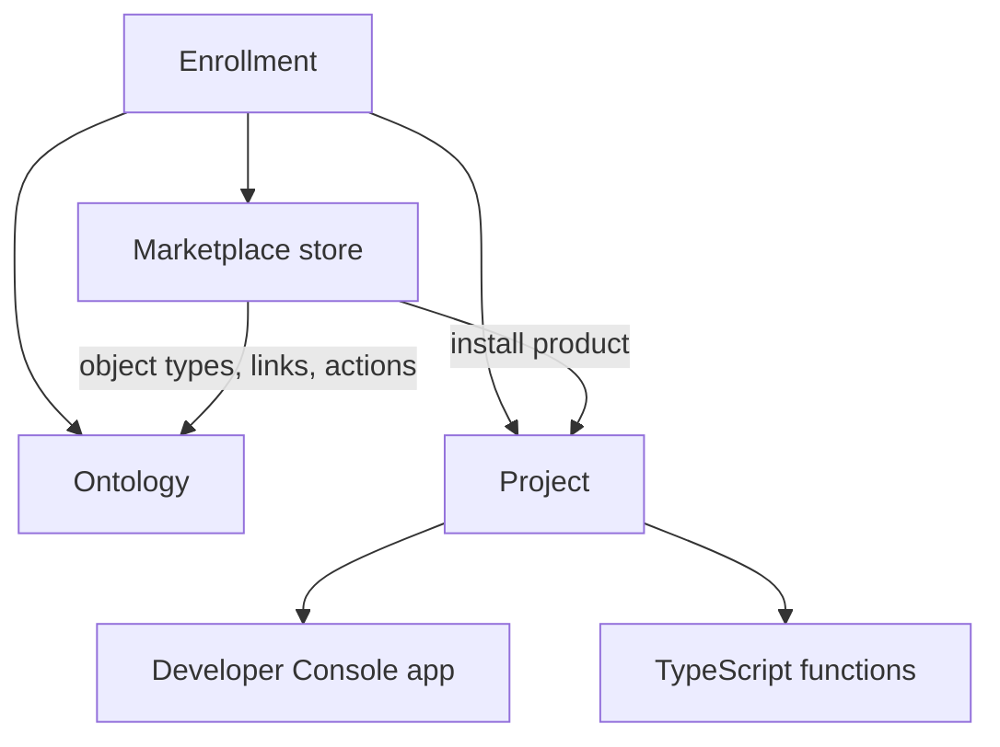
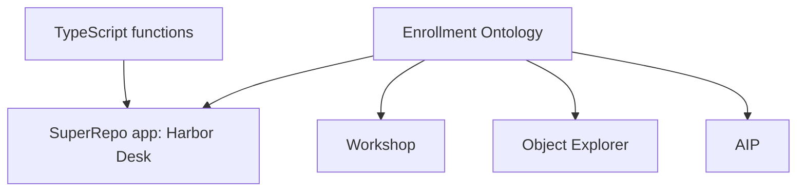
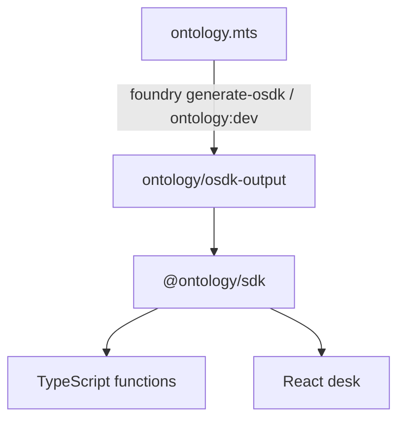
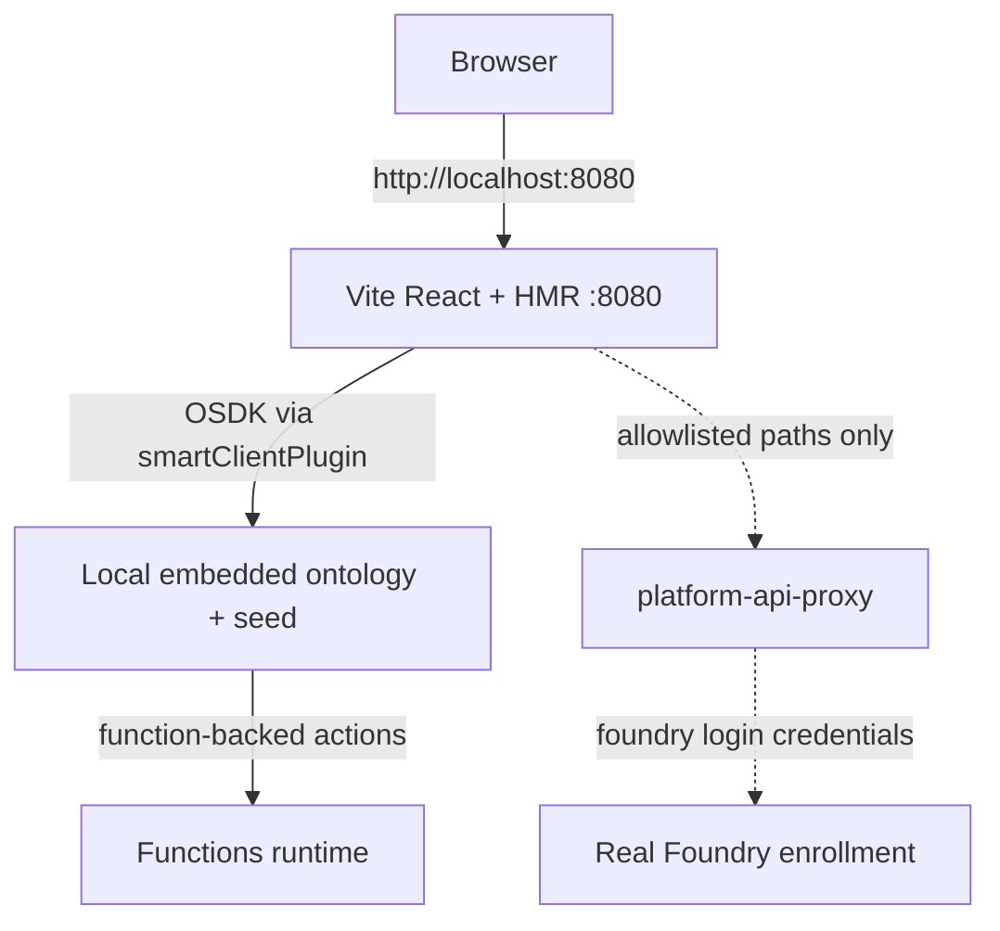
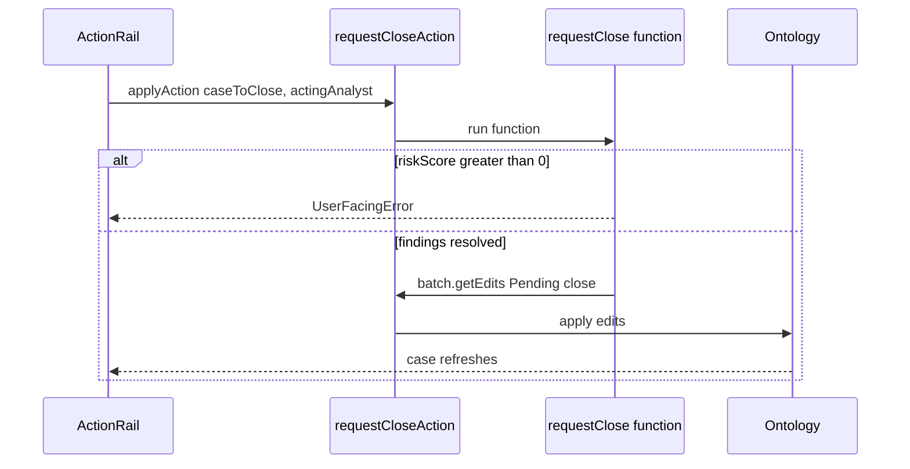
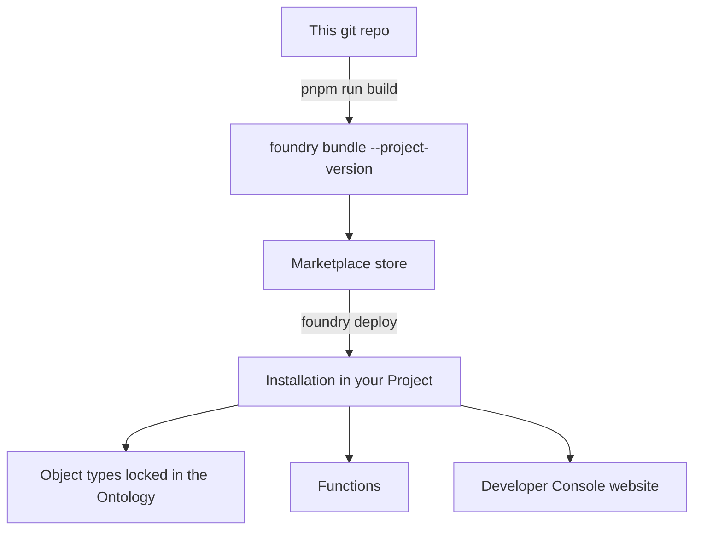

# Harbor Desk study guide

This repository is a **Foundry SuperRepo product** and a teaching artifact. Harbor Desk is a writeback casework desk: analysts open cases, attach findings to people, organizations, and wallets, and close a case only when every open finding is resolved and a second analyst approves.

Walk the product to learn how SuperRepo pieces connect. The same files that ship as a Marketplace product are the curriculum.

How Palantir wants you to **design** an Ontology (principles, anti-patterns, Harbor Desk as a worked example) is the [ontology guide](./ontology-guide.md). This file is how SuperRepo and this repo put that design on a desk.

[SuperRepo](https://www.palantir.com/docs/foundry/superrepo/overview/) went beta the week of 3 August 2026. Palantir’s wording: it is the direction pro-code Foundry is heading, it may not be on every enrollment, and it may change. Use this repo to learn the loop. Do not treat it as a replacement for pipelines, Data Connection, Workshop, or AIP.

**Official docs**

- [SuperRepo overview](https://www.palantir.com/docs/foundry/superrepo/overview/)
- [Core concepts](https://www.palantir.com/docs/foundry/superrepo/core-concepts/)
- [Tutorial: Develop with a SuperRepo](https://www.palantir.com/docs/foundry/superrepo/tutorial-develop-with-a-superrepo)
- [Prepare for your first deployment](https://www.palantir.com/docs/foundry/superrepo/prepare-first-deploy/)
- [Advanced workflows](https://www.palantir.com/docs/foundry/superrepo/advanced-workflows/)
- [FAQ](https://www.palantir.com/docs/foundry/superrepo/faq)
- [Coming in the future](https://www.palantir.com/docs/foundry/superrepo/in-development/)
- [August 2026 announcement](https://www.palantir.com/docs/foundry/announcements/2026-08/)
- [Marketplace overview](https://www.palantir.com/docs/foundry/marketplace/overview)
- [Ontology SDK](https://www.palantir.com/docs/foundry/ontology-sdk/overview/)

---

## 1. The one-sentence model

Foundry is one shared world (an **enrollment**). SuperRepo is a **pro-code packaging and preview interface** for three of that world’s pieces: ontology types, TypeScript functions, and a React website. Locally those three run as mock servers on your machine. On deploy they become real resources on your enrollment, installed through **Marketplace** into a **Project**, with object types materialized into the **Ontology** you chose at install time.

Local preview is a simulator. Palantir: local servers “mock a subset of interactions with a real Foundry instance.” Deploy is not “upload a website.” Deploy is “turn this repo into a Marketplace product and install it.”



---

## 2. Foundry as one system (read this before the repo)

If Marketplace, Projects, and Ontology feel like three products, SuperRepo will not make sense. They are layers of one enrollment.

### 2.1 Enrollment

An **enrollment** is your Foundry instance: one login, one (or more) Ontologies, a cap on resources. Everything you build — Workshop modules, pipelines, this SuperRepo, AIP — lives here.

A Dev-tier license is one enrollment. Community threads (Palantir staff, not an official product-docs page) report enrollment-wide quotas around **60 object types, 60 one-to-many link types, and 60 action types**. Harbor Desk adds **seven** object types, **twelve** one-to-many links, and **six** actions. Count before you install.

### 2.2 Project (Compass)

A **Project** is a folder that owns resources: datasets, code repositories, Workshop applications, Developer Console applications, and Marketplace installations. When `foundry deploy configure` asks where to install, it is asking **which Project should own the outputs**.

Marketplace install also asks which **Ontology** should receive object types, links, actions, and functions ([Install a product](https://www.palantir.com/docs/foundry/marketplace/install-product/)). The Ontology is chosen from the space; the Project is where the function, the website app, and the installation record live.

Those types are not magically visible to every user on the enrollment. Other apps can use them **if they have permission** (Ontology roles, project roles, markings). As of May 2026, some enrollments can also store ontology resources in Compass projects.

### 2.3 Ontology

The **ontology** is the data model: object types, properties, links, actions, functions, security. Ontology Manager is the UI for the same layer SuperRepo authors in `ontology.mts`.

After Harbor Desk deploys, `analyst`, `person`, `organization`, `ownershipInterest`, `wallet`, `investigationCase`, and `finding` are real object types. Object Explorer can list them. Workshop can be built on them. AIP can be granted them. They are not “SuperRepo-only objects.” Palantir: “Applications are never siloed by how their Ontology types were created.”

Two caveats:

1. SuperRepo-installed types are **locked**. Ontology Manager edits are overwritten on the next SuperRepo deploy ([FAQ](https://www.palantir.com/docs/foundry/superrepo/faq)). Code is the source of truth.
2. These types use `includeEmptyBackingDatasource: true`. They do not need a dataset. Instances exist because **actions** (or local seed) created them. That is different from a typical Foundry object type, which is backed by a dataset or stream produced by a pipeline. User edits still go through actions either way ([object edits](https://www.palantir.com/docs/foundry/object-edits/overview/)).

### 2.4 Marketplace

**Marketplace** is Foundry’s storefront for installing versioned products ([overview](https://www.palantir.com/docs/foundry/marketplace/overview)). You have already used it if you installed a Palantir learning bundle.

You may have access to one or more **stores**. The **Foundry Store** is available to all customers. Other stores are specific to your enrollment ([Browse products](https://www.palantir.com/docs/foundry/marketplace/browse-products/)). SuperRepo `foundry deploy` publishes to the store in `env.yml` (`store_rid`). Palantir’s example RID looks like `ri.marketplace.main.local.…`.

| Noun | Meaning |
|---|---|
| **Product** | A versioned bundle of resources. This repo’s product is `harbor-desk` in `foundry.yml`. |
| **Store** | A collection of products. `env.yml` contains a `store_rid` after you configure. |
| **Installation** | “Take this product version and create its outputs in this Project / Ontology.” |

`foundry deploy` uploads the product version and installs it with the inputs in `env.yml` ([core concepts](https://www.palantir.com/docs/foundry/superrepo/core-concepts/)). This product sets `installMode: SINGLETON` — Palantir’s default SuperRepo example. Later deploys of a new version update that installation rather than leaving you to invent a second copy.

Why SuperRepo uses Marketplace: Palantir already had a way to ship ontology + functions + apps as one reproducible, cryptographically signed artifact. SuperRepo compiles down to that artifact so local git and Foundry CI can use the same path.

### 2.5 Developer Console

A custom React/OSDK website is a **Developer Console application**: OAuth client, redirect URLs, hosted subdomain, uploaded website assets.

SuperRepo’s `APP` component becomes one of these on install. After `foundry deploy` succeeds, still open Developer Console and:

1. Confirm the website domain is approved.
2. Confirm the latest asset is deployed to production.

Until those two are done, ontology and functions can exist while the URL 404s. Palantir documents both steps in [Prepare for your first deployment](https://www.palantir.com/docs/foundry/superrepo/prepare-first-deploy/).

### 2.6 Workshop, pipelines, AIP (the rest of the system)

These are **not** SuperRepo components today. They consume the same Ontology.



Pipelines and Data Connections **produce datasets** that normally **back** object types. SuperRepo cannot author those yet ([FAQ](https://www.palantir.com/docs/foundry/superrepo/faq)). Chain ingest (Alchemy → datasets → ontology) still belongs on that classic path. After those object types exist, a SuperRepo can *import* them and own a custom app on top.

Harbor Desk wallets are **typed in**, not synced from a chain. That is a SuperRepo constraint, not a product choice you would keep in production ingest.

### 2.7 How this install sits next to classic Foundry work

Suppose you later create pipeline-backed `Wallet` and `Transaction` types in Ontology Manager, plus a Workshop investigation module.

That work does **not** live in this SuperRepo. It lives in a Data Connection / transform repo, Pipeline Builder or a Python/PySpark code repo, Ontology Manager, and a Workshop module in some Project.

Those objects and Harbor Desk’s writeback types can share an Ontology. They do not share a product. “One system” means **one Ontology they are allowed to share**, not “one SuperRepo must contain everything.”

The supported SuperRepo hybrid is the other direction: `foundry import ontology` to pull existing types into a SuperRepo so the React app and functions can use them with generated types.

---

## 3. What a SuperRepo is (and is not)

A SuperRepo is a git monorepo whose root `foundry.yml` declares Foundry components. The Foundry CLI uses that file for preview, codegen, bundle, and deploy.

Harbor Desk declares three components:

```yaml
components:
  - type: ONTOLOGY
    path: ./ontology
  - type: TYPESCRIPT_FUNCTIONS
    path: ./functions/typescript-functions
  - type: APP
    path: ./app
```

**It is**

- Ontology-as-code + TypeScript v2 functions + a React OSDK app
- A local preview that approximates ontology + functions + the website
- A single Marketplace product so those three version and install together

**It is not (yet)** — Palantir [FAQ](https://www.palantir.com/docs/foundry/superrepo/faq) and [Coming in the future](https://www.palantir.com/docs/foundry/superrepo/in-development/):

- Data pipelines / PySpark transforms
- Compute modules
- Python functions
- Functions that call APIs outside Foundry (Alchemy, REST, etc.)
- Automate
- Agent engine / Agent SDK
- Workshop modules authored in this repo

Until those land, SuperRepo is the right tool for **ontology-native writeback apps** (users create and update objects through actions) and the wrong tool for **ingest-and-investigate** apps.

---

## 4. This repository, mapped

```
foundry.yml                         # SuperRepo manifest: what ships together
package.json / project.json         # Nx orchestration (dev, build, configure)
├── ontology/
│   ├── src/ontology.mts            # SOURCE OF TRUTH: objects, links, actions
│   ├── seed/001-harbor.mts         # LOCAL ONLY sample instances
│   ├── external-imports/           # lockfile for types imported from Foundry
│   ├── src/generated-imports/      # generated from that lockfile (do not edit)
│   ├── osdk-output/                # generated OSDK (do not edit)
│   └── index.ts                    # re-exports generated types
├── functions/typescript-functions/
│   ├── src/lib/policy.ts           # risk weights, close status rules
│   ├── src/lib/demoScenario.ts     # Northwind graph (keep in sync with seed)
│   └── src/functions/              # openCase, addFinding, resolveFinding,
│                                   # requestClose, approveClose, loadDemoScenario
└── app/
    ├── index.html                  # OSDK meta tags (client id, ontology rid, …)
    ├── vite.config.ts              # aliases @ontology/sdk; seed reload plugin
    └── src/
        ├── client.ts               # createClient + mock auth locally
        ├── main.tsx                # OsdkProvider
        ├── router.tsx              # / and /cases/:caseId
        └── desk/                   # queue, case workspace, acting-as
```

Nx is only the task runner. The CLI does not read `project.json` ([advanced workflows](https://www.palantir.com/docs/foundry/superrepo/advanced-workflows/)). You could replace Nx; you could not delete `foundry.yml`.

When adding a feature, follow the dependency order: **ontology, then function, then action, then app**.

### 4.1 `foundry.yml` fields that matter

| Field | In this repo | Meaning |
|---|---|---|
| `components` | ontology, functions, app | What preview, bundle, and deploy include |
| `bundle.name` | `harbor-desk` | Marketplace product name |
| `bundle.mavenCoordinate` | `com.harbordesk:harbor-desk` | Product identity in the store |
| `bundle.installMode` | `SINGLETON` | Palantir’s default SuperRepo example |
| `osdkOutput` | `ontology/osdk-output` | Where codegen writes the client |
| `apiNamespace` | `com.harbordesk` | Namespace for generated ontology APIs |
| `imports` | lockfile path | Filled when you `foundry import ontology` |
| `platformApiProxy` | `getCurrent` user | Local-only: which Foundry HTTP APIs preview may proxy |

`signingKeys` points at a local Foundry CLI pem. Leave it. Do not commit a copied key.

---

## 5. The join: Ontology SDK (OSDK)

The OSDK is generated TypeScript for whatever the ontology component defines (and whatever you imported). Functions and the app both consume it. That is how a property added in `ontology.mts` shows up as `item.riskScore` in React without publishing a package.

Palantir on SuperRepo: “The OSDK is generated locally and regenerated whenever those definitions change… without republishing an SDK version between each change.”



`app/vite.config.ts` aliases `@ontology/sdk` at that generated `dist`. The functions package depends on the same output.

### 5.1 `apiName` vs the TypeScript const

The generated export name comes from `apiName`, not the exported const.

```ts
export const HarborCase: ObjectTypeDefinition = defineObject({
    apiName: "investigationCase",
    displayName: "Case",
    // ...
});
```

The generated export is `investigationCase`, not `HarborCase`. App and function code write:

```ts
import { investigationCase, requestCloseAction, analyst } from "@ontology/sdk";
```

`Osdk.Instance<investigationCase>` is the instance type. Actions kebab-to-camel their `apiName`: `request-close-action` becomes `requestCloseAction`.

**`case` is a JavaScript reserved word.** The object’s display name is “Case”; the API name is `investigationCase` so the OSDK export is a legal identifier. Import `investigationCase`. Do not try to name the type `case`.

`ontology/index.ts` re-exports those generated names. Do not edit `osdk-output/` or `src/generated-imports/`.

Until the first `pnpm run dev` (or `foundry generate-osdk`) has run, the editor will show `@ontology/sdk` import errors. That is expected.

### 5.2 `Osdk.Instance<T>` is the object

OSDK 2.0 does not give you a `Person` class instance. You get a typed bag of properties plus metadata:

```ts
const item: Osdk.Instance<investigationCase> = ...
item.title
item.status
item.$primaryKey   // always there
item.$apiName      // "investigationCase"
```

Functions take `Osdk.Instance<analyst>`, not string ids, when the parameter is “this analyst object.” The action then passes the object reference.

The client is a function:

```ts
const row = await client(investigationCase).fetchOne(pk);
const page = await client(investigationCase).fetchPage({ $pageSize: 50 });
await client(requestCloseAction).applyAction({ caseToClose, actingAnalyst });
```

Harbor Desk’s queue does **not** filter server-side yet — `useOsdkObjects(investigationCase, { pageSize: 50 })` and the UI slices. When the queue grows, `.where` belongs in the hook options, not in a local `.filter`. `openCase`’s `fetchPage({ $pageSize: 50 })` to detect a duplicate active case is the same demo-scale check.

### 5.3 `@osdk/react` — this is the app idiom

Palantir: “We recommend always using `@osdk/react` when building React applications with the OSDK” ([OSDK React](https://www.palantir.com/docs/foundry/ontology-sdk-react-applications/osdk-react/)). **Do not hand-roll `useState` + `useEffect` for OSDK reads.**

| Hook | Harbor Desk use |
|---|---|
| `useOsdkObjects(type, opts)` | Queue of cases; lists of analysts / people / orgs |
| `useOsdkObject(type, pk)` | Case page by route param; subject person/org |
| `useLinks(instance, linkApiName, opts)` | Findings on a case; wallets on a subject; ownership on an org |
| `useOsdkAction(action)` | Every write. `applyAction({ ... })`, `isPending` |
| `useOsdkFunction(fn, { params })` | Unused (no query functions) |
| `useRegisterUserAgent("harbor-desk/0.1.0")` | Telemetry string, once near the provider |
| `OsdkProvider` | Wraps the tree with the client |

```tsx
<OsdkProvider client={client} devMode={{ actionDelayMs: 0 }}>
```

This product deliberately does **not** use `$optimisticUpdate`. Local `actionDelayMs: 0` makes writes fast enough that optimistic UI would hide the round-trip the study guide is teaching. A real deployed app usually wants optimistic updates because the server round-trip is not free.

`streamUpdates: true` on object queries is correct for deployed Foundry (live invalidation). **Observed in this repo:** the local ontology does not serve `api/v2/ontologySubscriptions/...`; the platform API proxy answers `501 PlatformApiProxyPathNotAllowlisted`. Leave the flag. Do not add polling locally.

### 5.4 Links in the OSDK vs links in Maker

Maker **defines** the link. OSDK **traverses** it.

In React, `useLinks(item, "caseFindings", { pageSize: 50 })`. The string `"caseFindings"` is the apiName from the **one** side of `defineLink` (the case’s to-many). From a finding you would traverse `"parentCase"`.

The Palantir-native way to load a case’s subject is `useLinks(item, "subjectPerson")` / `subjectOrganization`. Harbor Desk’s `CasePage` / `SubjectPanel` currently pass hidden FKs (`item.personId`) into `useOsdkObject`. That works; it also leaks a join key into the UI. Named as a tradeoff in the ontology guide.

### 5.5 Auth and the client

```ts
export const client: Client = createClient(foundryUrl, ontologyRid, auth);
```

Local: dummy client id, dummy ontology RID, `VITE_USE_MOCK_AUTH=true`, `auth = async () => "mock-token-for-local-dev"`.

Deployed: real OAuth public client from Developer Console, redirect URL must match.

Palantir: the OSDK uses a token scoped to the ontological entities the app selected, **and** the user’s own permissions. That is why putting policy in functions still matters — the user might be allowed to call the action and still fail submission criteria.

---

## 6. Ontology-as-code in Harbor Desk

All of this lives in `ontology/src/ontology.mts`. Design rationale is in the [ontology guide](./ontology-guide.md).

### 6.1 Object types

Seven writeback types, each with a primary key, typed properties, `editsEnabled: true`, and `includeEmptyBackingDatasource: true`. Person and organization implement the `investigatable` interface (shared `id`, `name`, `jurisdiction`, `notes`). The interface is not an eighth object type.

| Type (`apiName`) | Role |
|---|---|
| `analyst` | Desk user. Maya Chen (lead), Jordan Hale (reviewer), Priya Shah |
| `person` | Natural person (Elena Varga). Implements `investigatable`. |
| `organization` | Legal entity (Northwind, Harbor Retail, Clearstream) with `legalForm`. Implements `investigatable`. |
| `ownershipInterest` | Object-backed UBO link (role + person + organization) |
| `wallet` | Chain + address, attributed to a person or organization (typed in, not synced) |
| `investigationCase` | Case: status, risk score, owner, close requester, exactly one subject |
| `finding` | Object-backed evidence on a case; open findings block close |

- **`editsEnabled`**: actions cannot mutate the type without this.
- **`includeEmptyBackingDatasource`**: no Foundry dataset required. Locally, seed fills it. On the enrollment, it starts empty; actions create rows.

Subject XOR (`personId` vs `organizationId` on a case; the same pattern on wallet ownership) is enforced in `openCase` and in seed / Load demo, not by the schema. Both FKs are optional; nothing at the type layer prevents writing both.

`riskScore` is a stored rollup of open finding weights. Palantir prefers a derived property at query time; these writeback types do not get one here, so every mutating action updates the copy. `severity` on a case is a priority band, a different fact.

### 6.2 Links

One-to-many links are carried by a foreign key on the many side. FK properties are `HIDDEN`. From a case instance the app reads `useLinks(item, "caseFindings")`. From an organization it reads `useLinks(org, "organizationWallets")` and `useLinks(org, "organizationOwnership")`.

| One side | Many side | FK |
|---|---|---|
| analyst `assignedCases` | investigationCase `owner` | `ownerId` |
| analyst `closeRequestedCases` | investigationCase `closeRequester` | `closeRequestedById` |
| person `personCases` | investigationCase `subjectPerson` | `personId` |
| organization `organizationCases` | investigationCase `subjectOrganization` | `organizationId` |
| person `personWallets` | wallet `ownerPerson` | `personId` |
| organization `organizationWallets` | wallet `ownerOrganization` | `organizationId` |
| investigationCase `caseFindings` | finding `parentCase` | `caseId` |
| person `personFindings` | finding `relatedPerson` | `personId` |
| organization `organizationFindings` | finding `relatedOrganization` | `organizationId` |
| wallet `walletFindings` | finding `relatedWallet` | `walletId` |
| person `personOwnership` | ownershipInterest `beneficialOwner` | `personId` |
| organization `organizationOwnership` | ownershipInterest `ownedOrganization` | `organizationId` |

### 6.3 Function-backed actions

Harbor Desk does not use a generated create action for Open case. Generated create cannot XOR person vs organization or hide `status` / `riskScore`.

**Function-backed actions** — `defineFunctionBackedAction({ functionApiName: "openCase" })` → `openCaseAction`. The ontology invokes the TypeScript function. The function **returns edits**. The action **applies** them. Palantir’s SuperRepo tutorial: “Only actions are allowed to mutate the Ontology's content.”

That split is load-bearing. Put “cannot close while findings are open” in the function, and Workshop, AIP, and the React app all get it. Put it only in React, and every other caller can skip it.

`openCase` generates `CASE-${Date.now()}`, sets Open / Medium / risk 0, and refuses if the subject already has an active case. It also refuses both or neither of `subjectPerson` / `subjectOrganization`.

**Load demo** is `status: "experimental"`. It is a technical bootstrap because seed never deploys, not a domain verb.

Function-backed actions are discovered against generated types. After a large ontology rewrite, generate objects first, then restore actions and generate again if codegen reports `Function "…" not found`.

Action parameter names differ by action kind:

| Action type | Object parameter |
|---|---|
| Create | properties passed directly (`id`, `title`, `status`, …) |
| Modify | `objectToModifyParameter` |
| Delete | `objectToDeleteParameter` |
| CreateOrModify | `objectToCreateOrModifyParameter` |
| Function-backed (Harbor Desk) | whatever the function args are (`caseToClose`, `actingAnalyst`, …) |

### 6.4 Seed (local only)

`ontology/seed/001-harbor.mts` default-exports a `createSeed` callback. Palantir: only top-level `.mts` files in `seed/` are compiled, in sorted filename order (hence `001-`).

Each `seed.add(type, { ... })` must include every non-nullable property, including the primary key. Keys must be unique per object type across the whole seed directory.

The ontology dev server is started as `foundry start ontology --seed-dir seed`. Each start (and each seed-file change) uses a **fresh local database**. Edits you make in the local UI are discarded on restart. Seed is re-applied. Palantir: the embedded Ontology “is not connected to your enrollment’s Ontology.”

**Seed is never deployed.** After install, Object Explorer will not show CASE-2041 until someone clicks **Load demo** (`loadDemoScenario`). Keep `seed/001-harbor.mts` and `functions/.../lib/demoScenario.ts` in sync: same ids, same Northwind graph.

Seed IDs worth memorizing: `ANALYST-MAYA` / `JORDAN` / `PRIYA`, `ORG-NORTHWIND` / `PER-VARGA`, `OWN-NORTHWIND-VARGA`, `WALLET-TREASURY` / `PERSONAL`, `CASE-2041`.

---

## 7. Functions (policy lives here)

Shared rules are in `functions/typescript-functions/src/lib/policy.ts`. Risk weights: Critical 40, High 25, Medium 12, Low 5, cap 100. At 50 an `Open` case becomes `In review`. CASE-2041 seeds at **65** (Critical + High open).

Each exported function follows the same shape. `requestClose` is the one to memorize:

```ts
function requestClose(
    client: Client,
    caseToClose: Osdk.Instance<investigationCase>,
    actingAnalyst: Osdk.Instance<analyst>,
): OntologyEdit[] {
    if ((caseToClose.riskScore ?? 0) > 0) {
        throw new UserFacingError(
            "Cannot request close while findings are still open. Resolve every open finding first.",
        );
    }
    const batch = createEditBatch<OntologyEdit>(client);
    batch.update(caseToClose, {
        status: STATUS_PENDING_CLOSE,
        closeRequestedById: actingAnalyst.id ?? String(actingAnalyst.$primaryKey),
    });
    return batch.getEdits();
}

export const config = { apiName: "requestClose" };
export default requestClose;
```

Read this as:

1. Inputs are OSDK instances (the action passes objects), not raw ids you fetch by hand.
2. Validation throws `UserFacingError` so the UI can show the message.
3. `createEditBatch` + `batch.update` / `batch.create` describes the write.
4. `return batch.getEdits()` hands the write to the action.
5. `config.apiName` must match `functionApiName` on `defineFunctionBackedAction`.

| Function | Rule |
|---|---|
| `openCase` | Exactly one person or organization; Open / Medium / risk 0 |
| `addFinding` | Writes the finding, adds severity weight to `riskScore`, may escalate Open → In review |
| `resolveFinding` | Only `Open` findings; subtracts weight |
| `requestClose` | Refuses Closed / Pending close; refuses while `riskScore > 0` |
| `approveClose` | Only Pending close; acting analyst cannot equal `closeRequestedById` |
| `loadDemoScenario` | Writes the Northwind graph if `CASE-2041` is missing |

The functions runtime is a local process during preview (`foundry start typescript-functions`) and a real Foundry function after deploy. Same source file.

Functions in SuperRepo **cannot call Alchemy or any external HTTP API** today ([Coming in the future](https://www.palantir.com/docs/foundry/superrepo/in-development/)). Until that lands, ingest lives in Data Connection, a transform repo, or a compute module — outside this SuperRepo.

The functions npm package is `@harbordesk/functions` (Marketplace identity is still `com.harbordesk:harbor-desk`).

---

## 8. The React desk

### 8.1 Boot

`app/index.html` has placeholders: `osdk-clientId`, `osdk-redirectUrl`, `osdk-foundryUrl`, `osdk-ontologyRid`.

Locally, Vite/`smartClientPlugin` fill these for the embedded ontology. After deploy, they point at your enrollment and the Developer Console OAuth client.

`app/src/client.ts` builds `createClient(foundryUrl, ontologyRid, auth)`. If `VITE_USE_MOCK_AUTH === "true"` (local preview), auth is a fake token. Otherwise it is `createPublicOauthClient` (real Foundry login, `/auth/callback` in `router.tsx`).

`app/src/main.tsx` wraps the tree in `OsdkProvider` and registers `harbor-desk/0.1.0`.

### 8.2 Acting-as

Local mock auth has no Foundry user. Four-eyes still needs two identities, so the header switcher stores an `analyst` object in `sessionStorage` (`ActingAsContext`). Maya Chen is the default. Policy functions receive that object as `actingAnalyst`.

After deploy, real OAuth is the logged-in Foundry user. Acting-as remains the demo’s way to play both sides of four-eyes without creating two Foundry accounts.

The desk is Blueprint dark (`bp6-dark` on `document.documentElement`). Routes: `/` queue, `/cases/:caseId` workspace.

---

## 9. Local preview architecture

On the platform, preview still uses the CLI, but you are inside a Code Workspace. Here, everything is processes on your machine.

### 9.1 What `pnpm run dev` starts

From the root `project.json`, Nx brings up:

1. **status-server** — `foundry start status-server`
2. **ontology** — `foundry start ontology --seed-dir seed` (after codegen bootstrap)
3. **typescript-functions** — `foundry start typescript-functions` (depends on ontology)
4. **platform-api-proxy** — `foundry start platform-api-proxy`
5. **await-services** — waits for `.palantir/.ontology-discovery.json`, `.typescript-functions-discovery.json`, `.platform-api-proxy-discovery.json`
6. **app** — Vite, only after those files exist
7. **display** — `foundry start display` prints the local URL

The app tries **http://localhost:8080**. If that port is taken, another is chosen and printed.

Each backend binds an **ephemeral port** and writes its URL into `.palantir/`. Vite’s `smartClientPlugin` (`@osdk/vite-plugin-superrepo`) reads those files and proxies OSDK traffic to the right local server. You do not hardcode ports.



Palantir: local servers mock a subset of a real Foundry instance. The embedded ontology approximates ontology behavior. It is not your enrollment. Changes in preview **never** appear on Foundry until you deploy.

### 9.2 Reload behavior

| Process | What happens on save |
|---|---|
| Vite / React | Hot module reload |
| Ontology server | `ontology.mts` change → regenerate OSDK. `seed/` change → in-process wipe and re-seed |
| Functions runtime | Reload the function |

A re-seed does **not** restart the ontology process, so Vite’s module graph does not change and HMR would not notice. `seedReloadPlugin` in `app/vite.config.ts` watches `ontology/osdk-output/seed-data.json`, which is written **at the end** of a re-seed, and sends a full reload. Watching `seed/*.mts` is too early: the file changes about a second before the new data is live.

### 9.3 Platform API proxy

Most OSDK calls hit the local ontology. A few hit real Foundry (current user, later maybe LLM proxy). `foundry.yml`:

```yaml
platformApiProxy:
  passthrough:
    - path: /api/v2/admin/users/getCurrent
      methods: [GET]
```

Only listed paths are proxied. These requests use credentials from `foundry login`, not the token you used to install the CLI. If proxied calls start failing auth, `foundry login refresh`.

**This block does not affect the deployed product.** It is preview-only.

### 9.4 Auth locally vs deployed

| | Local | Deployed |
|---|---|---|
| Auth | Mock token + acting-as analyst | Foundry OAuth (Developer Console client) |
| Ontology | Embedded, seeded | Chosen Ontology, empty until **Load demo** or other actions |
| Functions | Local runtime | Foundry function |
| Website | Vite on :8080 | Foundry-hosted subdomain |
| `streamUpdates` | 501 from proxy (observed here) | Real websocket once supported |

### 9.5 Install path

Always `foundry install pnpm`, never bare `pnpm install`. `.npmrc.foundry` points at `${FOUNDRY_HOSTNAME}`’s npm registry. Only the CLI injects credentials.

---

## 10. Walk requests end to end

These traces are the curriculum. Do them in the running app, then open the files.



### 10.1 Open a case (function-backed)

1. Header **Open case** calls `openAction.applyAction({ actingAnalyst, subjectPerson | subjectOrganization })`.
2. `@osdk/react` sends that to the ontology (local server, or Foundry after deploy).
3. `openCaseAction` is function-backed. `openCase` refuses both/neither subject, refuses an already-active subject, then creates the case at Open / Medium / risk 0.
4. `useOsdkObjects(investigationCase)` updates (refetch locally; stream when deployed).
5. The new row appears in the queue.

There is no SQL and no REST handler you wrote. The action **is** the write API for user edits.

### 10.2 Add a finding (function-backed, mutates two types)

1. On a case, submit a finding. `addFindingAction.applyAction({ caseToUpdate, actingAnalyst, title, … })`.
2. Ontology sees `add-finding-action` → `functionApiName: "addFinding"`.
3. Functions runtime runs `addFinding`.
4. The function creates a `finding` and updates the case’s `riskScore` (and maybe `status`) in one edit batch.
5. The **action** applies both edits.
6. `useLinks(item, "caseFindings")` and the case header refresh.

Policy is in the function. The React form never computes risk.

### 10.3 Request close (the interesting refusal)

1. As Maya, click **Request close** while CASE-2041 still has open findings (`riskScore` 65).
2. `requestClose` throws `UserFacingError`. The rail surfaces the message.
3. Resolve open findings until risk is 0. Each `resolveFinding` subtracts weight.
4. Request close again. The function sets `status: "Pending close"` and `closeRequestedById` to Maya.
5. Stay Maya, **Approve close**. `approveClose` refuses: same analyst.
6. Switch acting-as to Jordan Hale, approve. Status becomes `Closed`.

Same path locally and on Foundry. Only the processes behind the OSDK client change.

### 10.4 Load demo (seed’s deployed twin)

Locally you never need this: seed already wrote CASE-2041. After deploy, seed did not run. **Load demo** calls `loadDemoScenario`, which creates the same graph from `demoScenario.ts` if `CASE-2041` is missing.

---

## 11. Learning path (use the desk as the curriculum)

Do this in order. Each step names the files in all three layers.

| Step | You do | What it teaches |
|---|---|---|
| 1 | `pnpm run dev`, open the queue | Seed → local ontology → `useOsdkObjects` |
| 2 | Open CASE-2041, read subject + wallets | Links: `subjectPerson` / `subjectOrganization`, `personWallets` / `organizationWallets`, `caseFindings` |
| 3 | Add a finding, watch risk | Function returns edits; action applies them; UI does not own policy |
| 4 | Request close too early, then after resolve | `UserFacingError` vs successful edit batch |
| 5 | Four-eyes: Maya then Jordan | Acting-as stand-in; `closeRequestedById` |
| 6 | (Optional) sandbox deploy + **Load demo** | Seed never deploys; three components ship as one product |

When you save `ontology.mts`, watch the `ontology:dev` pane in the `foundry start` TUI (Tab / arrows). That is codegen happening. Palantir documents the same trick in the SuperRepo tutorial.

Suggested paper trace for a new reader: `ActionRail.tsx` → `request-close-action` in `ontology.mts` → `requestClose.ts` → edits applied → case header refresh.

---

## 12. Deploying this SuperRepo

You do not need Palantir VS Code. The CLI is enough. Palantir documents two paths: tag inside the platform (Foundry CI), or `pnpm run build && foundry deploy` from your laptop / any CI.



### 12.1 Prerequisites

1. Foundry CLI installed and `foundry login` against **your** enrollment URL.
2. For deploy from outside Foundry CI: `FOUNDRY_TOKEN` set to a [user-generated token](https://www.palantir.com/docs/foundry/platform-security-third-party/user-generated-tokens/#user-generated-tokens) with **Foundry DevOps publishing** permissions ([Prepare for your first deployment](https://www.palantir.com/docs/foundry/superrepo/prepare-first-deploy/)).
3. SuperRepo enabled on the enrollment (beta). If deploy fails immediately, this is the first check.
4. A **sandbox Project** to install into. Do not drop seven writeback types into a Project you care about.
5. Headroom on Dev-tier quotas (community-reported, see §2.1).

### 12.2 Configure once

```bash
pnpm run configure
```

That runs `foundry deploy configure` after a dry-run build so the CLI knows the product’s inputs. It is interactive. Typical prompts: Marketplace **store**, target **Project** / namespace, website **domain**, markings / organization inputs if required.

It writes **`env.yml`** at the repo root (store RID, folder RID, markings, subdomain).

**Palantir vs this public repo.** Palantir’s deploy docs and the August 2026 announcement say: **commit `env.yml`**, because Foundry CI reads it when you deploy by tag. That is the right workflow for a private team SuperRepo aimed at a known enrollment.

This GitHub repo **gitignores `env.yml`** and ships `env.yml.example`. The file holds enrollment-specific RIDs and markings; committing it would publish someone else’s Foundry coordinates. Copy the example after you configure. Re-run configure when the target changes (including after renaming the product).

If `env.yml` is missing, `foundry deploy` will run configure first.

Pass-through example:

```bash
pnpm run configure -- --store-rid ri.marketplace.main.store.example
```

### 12.3 Build and deploy from this laptop

```bash
FOUNDRY_PRODUCT_VERSION=1.0.0 pnpm run build
foundry deploy
```

What `pnpm run build` actually does (Nx graph):

1. Ontology: `foundry generate-osdk`
2. Functions: compile, pack OSDK into the function bundle, `foundry build function-ts`
3. App: Vite production build, then `foundry build website`
4. Root: `foundry bundle --project-version "${FOUNDRY_PRODUCT_VERSION:-1.0.0}"`

Palantir: `--project-version` expects a **semantic version** (`MAJOR.MINOR.PATCH`) that becomes the Marketplace product version. No `v` prefix. If you omit `FOUNDRY_PRODUCT_VERSION` locally, the bundle is `1.0.0` and a second deploy collides with the first.

This repo’s Foundry CI template (`ci.yml`) skips tag `0.0.1` (the template’s initial tag) and skips any tag that is not `MAJOR.MINOR.PATCH`. That is template CI behavior, not a sentence on Palantir’s SuperRepo product pages.

### 12.4 The other path (Foundry git)

If you later push this repo into Foundry’s git, tag a semantic version. Foundry CI builds and deploys. Same `env.yml` (which Palantir expects to be committed in that workflow).

### 12.5 Verify

1. Marketplace → your installation → succeeded.
2. Ontology Manager → Analyst, Person, Organization, Ownership interest, Wallet, Case, Finding exist (locked). There is no `entity` type.
3. Developer Console → that application:
   - Website hosting → domain approved
   - Website hosting → Assets → deploy latest to production if needed
4. Open the site. Queue is empty. Click **Load demo**.
5. Object Explorer → CASE-2041 and the Northwind graph.

---

## 13. After install: locked types, empty data, one Ontology

**Locked.** FAQ: you should not edit SuperRepo-created types in Ontology Manager. You can unlock the project, but the next SuperRepo deploy overwrites those edits. Change `ontology.mts` and deploy `1.0.1` instead.

**Empty.** Seed stayed on your laptop. The backing datasource is empty. **Load demo** (or any other action) is how rows appear.

**Shared.** Those types are in the Ontology you installed into. A Workshop module in another Project can use `investigationCase` if it has permission. That is also why a sloppy deploy pollutes a real Ontology — use a sandbox Project and be ready to live with seven extra types, or accept that deleting them may require removing the Marketplace installation.

If an older SuperRepo from this same folder was already installed (the original tutorial product, or a version that still had `entity`), uninstall it first or accept that singleton upgrade replaces those types.

---

## 14. Importing an existing ontology (the hybrid)

This product defines writeback types locally so preview works offline. To build an app on types you already created in Ontology Manager (for example pipeline-backed `Wallet` / `Transaction`):

```bash
foundry import ontology \
  --ontology-rid ri.ontology.main.ontology.<uuid> \
  --objects YourObjectApiName
```

Or use **Ontology Imports** in the Palantir VS Code extension; it prints the same command.

That writes `ontology/external-imports/ontology-full-metadata.json` (commit this lockfile — Palantir: codegen depends on it). Codegen produces stubs under `ontology/src/generated-imports/`. Reference those from `ontology.mts`, then add links, actions, functions, and UI around them.

Imported types were born in Ontology Manager; SuperRepo-defined types are born in code. Both are visible in the UI after install.

For a production investigation desk, the sound hybrid is: **classic Foundry owns ingest + pipelines + object types**; a SuperRepo **imports** those types and owns the custom app/functions. Do not let SuperRepo create `Wallet` if a pipeline needs to back it in the UI — the lock will fight you. Harbor Desk’s wallets are writeback on purpose, so the SuperRepo can demo without ingest.

---

## 15. Dev-tier notes

- Marketplace exists on Developer tier. Learning bundles already use it. SuperRepo deploy is the same mechanism, from the CLI.
- SuperRepo may not be enabled. Beta flag / enrollment support is required.
- Object / link / action quotas (community-reported ~60 each) are enrollment-wide. Harbor Desk adds seven types, twelve links, six actions. If an older install still has `entity`, delete it before upgrade.
- DevOps publishing permission is required for `foundry deploy` from your laptop.
- `mavenCoordinate: com.harbordesk:harbor-desk` is the durable product name. Do not revert it to the `foundry create` timestamp.
- Keep Harbor Desk in a sandbox Project even though it can share an Ontology with other work.

---

## 16. Gotchas

- `@ontology/sdk` editor errors until first codegen.
- `foundry install pnpm`, not `pnpm install`.
- Export names come from `apiName`, not the const. Display name “Case” → `investigationCase` because `case` is a JavaScript reserved word.
- Duplicate primary keys on create → `Ontologies:ObjectAlreadyExists`.
- `streamUpdates` is a local 501 (observed here); leave it for production.
- Seed is not production data. After deploy, use **Load demo**.
- Keep `001-harbor.mts` and `demoScenario.ts` in sync.
- Ontology Manager edits to SuperRepo types are overwritten on deploy.
- Platform API proxy allowlist is preview-only.
- `ontology.mts` is 4-space indented; match the file.
- Functions cannot call out of Foundry yet.
- A tag that is not `MAJOR.MINOR.PATCH` does not publish in this template’s CI (`ci.yml`). `0.0.1` is skipped there as the initial template tag.
- Function-backed actions need functions discoverable against the generated SDK. After a large ontology rewrite, generate objects, then actions.
- Local four-eyes uses ontology `analyst` objects because mock auth has no Foundry user.
- Palantir says commit `env.yml` for Foundry CI. This public repo gitignores it. Copy `env.yml.example`.

---

## 17. Command cheat sheet

```bash
# Auth
foundry login
foundry login refresh
export FOUNDRY_TOKEN="…"

# Local
foundry install pnpm
pnpm run dev                 # http://localhost:8080

# Deploy (this laptop)
pnpm run configure
FOUNDRY_PRODUCT_VERSION=1.0.0 pnpm run build
foundry deploy

# Optional: import existing types
foundry import ontology --ontology-rid ri.ontology.main.ontology.<uuid> --objects Wallet
```

App-only checks (also chained into `app` build):

```bash
cd app && pnpm run typecheck
cd app && pnpm run lint
```

---

## 18. How to teach from this repo

1. Run `pnpm run dev`. Walk the demo script in the README (~90 seconds) before opening files.
2. For each click, name the three layers: ontology type or action, function (if any), React hook.
3. Trace **Request close** on paper: `ActionRail.tsx` → `requestCloseAction` in `ontology.mts` → `requestClose.ts` → edits applied → `useOsdkObject` refresh.
4. Re-read section 2 of this guide until Enrollment / Project / Ontology / Marketplace / Developer Console are distinct.
5. Read the [ontology guide](./ontology-guide.md) for why person and organization are split, why ownership is an object, and why `riskScore` is stored.
6. One sandbox deploy: configure → build `1.0.0` → deploy → approve website → **Load demo** → find CASE-2041 in Object Explorer.
7. When SuperRepo gains pipelines and external sources, import the ontology you already built on classic Foundry. Harbor Desk stays the writeback / policy / UI example.

---

## 19. Glossary

| Term | Meaning |
|---|---|
| **Enrollment** | Your Foundry instance |
| **Project** | Compass folder that owns installed resources |
| **Ontology** | Shared object types, links, actions, and their data |
| **Object type** | Entity schema (`investigationCase`, `finding`, …) |
| **Link** | Typed relationship; 1-to-many uses a FK on the many side |
| **Action** | How user edits are applied; plain or function-backed |
| **Function** | Server-side logic; returns edits; action applies them |
| **OSDK** | Generated TypeScript client for objects, actions, functions |
| **Seed** | Local-only sample instances (`001-harbor.mts`) |
| **Load demo** | Deployed twin of seed (`loadDemoScenario`) |
| **Acting-as** | Analyst object used as a stand-in for the Foundry user |
| **Four-eyes** | Close requester cannot be the approver |
| **Marketplace product** | Versioned bundle SuperRepo compiles into (`harbor-desk`) |
| **Marketplace store** | Collection of products; Foundry Store vs enrollment-specific |
| **Installation** | Product version materialized into a Project / Ontology |
| **Developer Console** | OAuth + hosted website for the React app |
| **Singleton** | `installMode` in this product’s `foundry.yml` (Palantir’s default example) |
| **Locked type** | SuperRepo-managed; UI edits lost on next deploy |
| **Preview** | Local mock of ontology + functions + app |
| **Bundle** | `foundry bundle` output; the deployable artifact |
